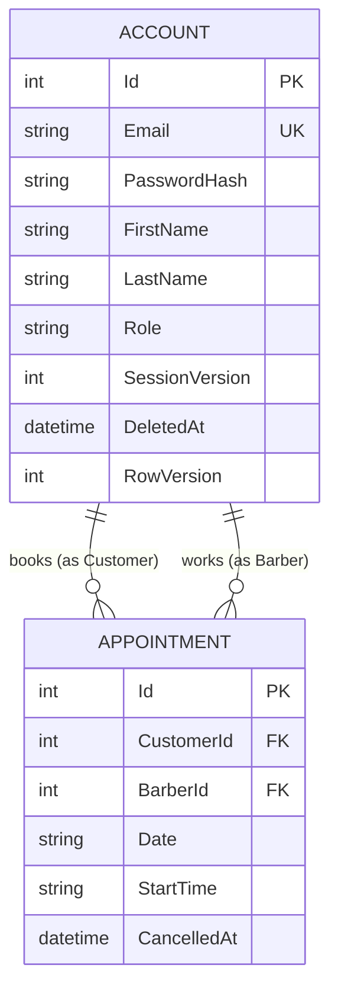

# Architecture Spine — Barbershop Appointment Scheduler

## Design Paradigm

**Layered Architecture (Controller-Service-Repository).** Backend namespaces map directly to layers: `Controllers/` (HTTP surface, one per role/domain concept) → `Services/` (business rules, transactions) → `Repositories/` (EF Core/SQLite data access). One Controller/Service/Repository trio per domain concept — Auth, Booking, Account/Admin — not per entity and not a single catch-all. Dependencies flow one way only; see AD-1.

## Invariants & Rules


### AD-1 — Layered backend architecture

- **Binds:** all backend code; Auth, Booking, Account/Admin domains (NFR6)
- **Prevents:** cross-layer shortcuts (e.g., a controller querying EF Core directly), god-classes spanning multiple domains
- **Rule:** Controllers depend on Services depend on Repositories, one-way, never reversed or skip-level. One Controller/Service/Repository trio per role or domain concept (Auth, Booking, Account/Admin) — no shared catch-all classes.

### AD-2 — Role & session liveness enforced server-side per request

- **Binds:** all protected endpoints; FR3, FR14, FR35
- **Prevents:** trusting a JWT's role claim (stale after a permission change) or letting a revoked/password-changed session keep working; Controllers independently inventing inconsistent auth-failure status codes; `Role` string literals drifting in casing between call sites
- **Rule:** every protected endpoint re-derives the account's current Role from the DB per request (the same lookup also checks SessionVersion, so it's not an extra query); a JWT's SessionVersion claim is compared to the DB's current value on every protected request. Status codes are fixed: **401** for unauthenticated or session-invalid (missing/expired token, SessionVersion mismatch); **403** for authenticated-but-wrong-role. Only an admin-driven password change (FR35) increments SessionVersion; permission/role changes never do — role liveness is handled entirely by the DB re-check, not token invalidation. `Role` is a fixed enum — `Customer` | `Barber` | `Admin`, PascalCase — one shared type referenced everywhere (seeder, auth checks, DB storage), never an ad-hoc string literal.

### AD-3 — Token transport & refresh lifecycle

- **Binds:** all authenticated requests; FR2, FR23, FR35
- **Prevents:** storing tokens in localStorage or JS-readable cookies (XSS exposure); requiring full re-login on every access-token expiry
- **Rule:** access token (JWT, 60-min expiry) held in memory only, sent as `Authorization: Bearer`; refresh token (JWT, 15-day expiry, carries SessionVersion) lives in an HttpOnly+Secure+SameSite=Strict cookie, never read by JS. `POST /api/auth/refresh` validates SessionVersion and mints a new access token, called on access-token expiry and on every fresh page load; `GET /api/auth/me` bootstraps identity for the frontend since the cookie is unreadable, returning exactly `{ id, email, firstName, lastName, role }` — no other endpoint invents its own shape for "who am I." Refresh tokens are non-rotating — a stolen refresh cookie stays valid up to 15 days or until the next password change (rotation/reuse-detection deferred, see Deferred).

### AD-4 — Testing strategy

- **Binds:** NFR4; all
- **Prevents:** mocking the database layer in backend tests; adding a request-mocking framework for the frontend's small fetch surface
- **Rule:** backend tests use xUnit + WebApplicationFactory against a real SQLite instance (NFR4), isolated from the dev DB; frontend component tests use Vitest + jsdom + React Testing Library + user-event, stubbing API calls directly via `vi.fn()`/`vi.spyOn(fetch)` — no MSW. Playwright e2e is optional and mocks nothing.

### AD-5 — Login rate limiting

- **Binds:** FR2, NFR1; `/api/auth/login`
- **Prevents:** unbounded brute-force credential guessing
- **Rule:** built-in `Microsoft.AspNetCore.RateLimiting`, sliding window, 5 attempts per email+IP per 15-minute window on the login endpoint; over-limit returns 429 with the same generic invalid-credentials message as a normal failed login.

### AD-6 — First-admin bootstrap

- **Binds:** FR31, FR34
- **Prevents:** an admin-creation UI/backdoor; seed credentials committed to source control
- **Rule:** a single `IHostedService` runs after `Database.Migrate()`, seeding exactly one admin account via `PasswordHasher<T>` if none exists. Credentials come only from environment variables (`AdminSeed__Email`/`AdminSeed__Password`) — shell locally, a GitHub Actions secret in CI — never `dotnet user-secrets` (one credential path everywhere, not two tools to keep in sync). `appsettings.json` keeps only empty placeholder keys.

### AD-7 — Primary key strategy

- **Binds:** all entities
- **Prevents:** introducing GUID/UUID primary keys
- **Rule:** all entity primary keys are int auto-increment, justified by a single local SQLite instance with no distributed-write concern; do not switch to GUIDs without revisiting this AD.

### AD-8 — Appointment status is computed, not stored

- **Binds:** FR24, FR18, FR40; Appointment entity
- **Prevents:** a background job/scheduled task to flip appointment status; a stored status field drifting from real time; a hard SQL DELETE on Appointment from any trigger
- **Rule:** "Finished" (FR24) is computed at read time by comparing Date/StartTime to current EST "now" (AD-12), never persisted. Cancellation is the only real state change, captured as a nullable `CancelledAt` (soft-delete; row retained for history per FR18/FR40). "Cancels and deletes" in FR18/FR40 (demoting/removing a barber cancels their future appointments) means this same soft-cancel — setting `CancelledAt` — never a hard row delete, regardless of trigger (user cancellation, demotion cascade, or account-deletion cascade, AD-15). One mechanism for every cancellation path.

### AD-9 — Double-booking guard is defense-in-depth

- **Binds:** NFR2, FR9, FR10
- **Prevents:** a race between two near-simultaneous bookings for the same slot both succeeding; the same signed-in customer holding two appointments at the same date/time across different barbers (FR9)
- **Rule:** application-level check-then-insert inside a transaction is the primary guard; two DB-level partial unique indexes are the hard backstop against any application-logic bug: `UNIQUE(BarberId, Date, StartTime) WHERE CancelledAt IS NULL` (no double-booking a barber's slot) and `UNIQUE(CustomerId, Date, StartTime) WHERE CancelledAt IS NULL` (no customer holding two simultaneous appointments across barbers).

### AD-10 — Dev database & CI isolation

- **Binds:** NFR7; CI
- **Prevents:** committing local data to source control; CI tests touching or corrupting the dev DB
- **Rule:** the SQLite file lives at `backend/BarbershopApi/App_Data/barbershop.db`, gitignored — only `Migrations/` (code) is committed. The dev DB starts empty via `Database.Migrate()` on startup, no seeded sample data (see Deferred). CI tests run against their own separate temp SQLite instance via `WebApplicationFactory`.

### AD-11 — CI pipeline

- **Binds:** NFR5, NFR7, NFR4
- **Prevents:** merging a change that breaks either test suite; treating CI as a real-deploy signal it isn't
- **Rule:** one GitHub Actions workflow runs on every push, with parallel jobs for the .NET suite (real SQLite, NFR4) and the frontend suite (Vitest); a red pipeline is not mergeable — the DORA signal this project demonstrates, since no real deploy target exists (NFR7).

### AD-12 — Fixed EST timezone semantics

- **Binds:** NFR1; FR7, FR8, FR11
- **Prevents:** comparing dates/times in UTC or the client's local clock; a hardcoded UTC-5 offset that breaks across DST
- **Rule:** "EST" means US Eastern Time (`America/New_York`), correctly DST-aware, computed server-side; the server is sole authority on "today," "past," and the 30-minute booking cutoff.

### AD-13 — CORS & credentialed requests

- **Binds:** all; frontend↔API requests
- **Prevents:** the refresh cookie silently failing to send cross-origin during local dev
- **Rule:** the API's CORS policy explicitly allows the Vite dev-server origin with `AllowCredentials()`; every frontend fetch touching auth sets `credentials: 'include'`. `SameSite=Strict` is unaffected by the port difference (site = registrable domain, not port), and NFR7's local-only scope means cross-domain `SameSite=None` never arises.

### AD-14 — Booking date-range validity is always server-revalidated

- **Binds:** FR7, FR8
- **Prevents:** trusting the calendar/time-dropdown widget's client-side disabling as the actual guard (same failure mode AD-2/FR3 closes for role checks)
- **Rule:** on every booking submission, the server independently re-checks: date is not in the past, date is a weekday (weekends closed), date is within the 30-day forward cap (FR7), and — for a same-day booking — the slot isn't within 30 minutes of current EST time (FR8/AD-12). A disabled calendar cell or filtered dropdown option is a UX convenience, never the enforcement point.

### AD-15 — Account soft-delete with relaxed email uniqueness

- **Binds:** FR40; Account entity
- **Prevents:** hard-deleting an Account and orphaning the FK on historical Appointments that must be retained (FR18/FR40); an email being permanently unregistrable after its account is deleted
- **Rule:** Account deletion is soft-delete — a nullable `DeletedAt`, same shape as Appointment's `CancelledAt` — the row is retained forever so historical appointments still resolve to a name. The unique constraint on Email is scoped to non-deleted rows: `UNIQUE(Email) WHERE DeletedAt IS NULL`, so a deleted account's email becomes registerable again immediately. A deleted account can never sign in (auth checks treat `DeletedAt IS NOT NULL` the same as "account does not exist").

### AD-16 — Account optimistic concurrency

- **Binds:** FR41, NFR2; Account entity
- **Prevents:** an admin edit racing a user's own self-edit (or two admin edits, or an edit racing a delete) silently overwriting or corrupting the account
- **Rule:** Account carries an EF Core concurrency token (`RowVersion`/`[Timestamp]`); the first commit wins, the second gets a conflict error (`ProblemDetails`, 409) rather than a silent overwrite — the same "first commit wins" guarantee as AD-9's booking guard, applied to account mutation.

### AD-17 — Single read path for appointment views

- **Binds:** FR11, FR15, FR24; Appointment entity
- **Prevents:** the customer's own list, a barber's own schedule, and the admin's oversight view each independently computing "Finished" or naming fields differently, drifting apart at the EST boundary
- **Rule:** all three views read appointments through one shared `BookingService` method (or a shared read-model it returns) — including the Finished computation (AD-8) — never duplicated per-Controller.

### AD-18 — Client-side routing mirrors server-side role gating

- **Binds:** FR3, FR4; frontend
- **Prevents:** a route guard that only hides a nav link (client-side-only gating is not access control — the same principle AD-2 enforces server-side)
- **Rule:** client-side routing uses React Router (current major, v7+ — confirm the exact package, `react-router` vs. `react-router-dom`, against current docs at scaffold time given recent packaging changes across v6→v7→v8). Route guards call `GET /api/auth/me` to determine identity/role and redirect unauthenticated or wrong-role access; hiding a nav item (FR3) is a UX nicety layered on top, never the enforcement itself.

## Consistency Conventions

| Concern | Convention |
| --- | --- |
| Naming (entities, files, interfaces, events) | PascalCase for C# types/methods/properties; camelCase for JSON payloads (System.Text.Json default) and JS/React code. |
| Data & formats (ids, dates, error shapes, envelopes) | Dates/times on the wire are plain `yyyy-MM-dd` / `HH:mm` strings, no offset — client never does timezone math (server is sole authority, AD-12). Errors use ASP.NET Core's built-in `ProblemDetails` (RFC 7807) — automatic for `[ApiController]` validation errors, `Problem()` helper for custom errors (booking conflict, stale cancellation). |
| State & cross-cutting (mutation, errors, logging, config, auth) | Auth: DB-derived role + SessionVersion checks, split access/refresh tokens, fixed 401/403 split, `Role` enum (AD-2, AD-3). CORS: Vite dev origin allowed with credentials (AD-13). Concurrency: optimistic `RowVersion` on Account (AD-16), unique-index backstop on Appointment (AD-9) — first commit wins everywhere. |

## Stack

| Name | Version |
| --- | --- |
| .NET | 10 (LTS, supported to 2028-11) |
| ASP.NET Core Web API | 10 — `dotnet new webapi --use-controllers` (controllers, not minimal APIs) |
| EF Core | 10.0.10 |
| Microsoft.EntityFrameworkCore.Sqlite | 10.0.10 |
| Microsoft.AspNetCore.Authentication.JwtBearer | 10.0.9 |
| ASP.NET Core Identity `PasswordHasher<T>` (PBKDF2) | bundled with .NET 10 |
| Microsoft.AspNetCore.RateLimiting | bundled with .NET 10 (no third-party package) |
| React | 19.2.8 |
| Vite | 8.1.5 — official React JS template (non-TS variant) |
| Frontend language | JavaScript (no TypeScript) |
| Frontend data-fetching | plain `fetch` + React state (no React Query/TanStack Query) |
| React Router | current major, v7+ (AD-18) — confirm exact package name at scaffold time |
| @radix-ui/react-dialog | 1.1.21 — modal (account-edit, confirm-action popups) |
| @radix-ui/react-select | 2.3.4 — dropdowns (barber-select, time-slot, admin permission-select) |
| @radix-ui/react-popover | 1.1.16 — calendar trigger/panel container |
| react-day-picker | 10.0.1 — calendar grid logic, paired with Popover (Radix has no native calendar primitive; this is Radix's own recommended pairing) |
| xUnit.v3 (+ WebApplicationFactory) | 3.2.2 |
| Vitest | 4.1.10 |
| @testing-library/react | 16.3.2 |
| @testing-library/jest-dom | 7.0.0 (requires Node ≥22, `@testing-library/dom` peer dep) |
| @testing-library/user-event | 14.6.1 |
| Playwright | 1.61.1 — optional e2e |

## Structural Seed

```text
{repo-root}/
  backend/
    BarbershopApi/
      Controllers/       # one per role/domain concept: Auth, Booking, Account/Admin
      Services/
      Repositories/
      Entities/
      Dtos/
      Data/              # DbContext, Migrations/ (committed), App_Data/barbershop.db (gitignored)
    BarbershopApi.Tests/
  frontend/
    src/
      pages/
      components/
      api/
      styles/
  .github/
    workflows/
      ci.yml
  _bmad/                 # existing
  _bmad-output/           # existing
  docs/                  # existing
```



**Deployment & CI envelope:** runs locally only (NFR7) — no production hosting or public deploy target. GitHub Actions CI (AD-11) is the only "deployment-shaped" surface: it keeps the codebase provably deployable on every push without deploying anywhere.

## Deferred

- **Refresh-token rotation & reuse-detection** — accepted trade-off for now (AD-3); revisit as a future hardening pass if the stolen-cookie exposure window (up to 15 days) becomes unacceptable.
- **Guest (unauthenticated) booking** — PRD non-goal, called out as a possible same-day addition that never landed; revisit architecture if it's added later.
- **Dev database seeding with sample data** — explicitly declined; dev DB starts empty via `Database.Migrate()` (AD-10).
- **UX open items touching implementation** — DESIGN.md flags no error/warning color exists yet for form-validation states (e.g., password-mismatch messages), and the exact tablet breakpoint pixel value is undefined (only named, not sized); both need a decision before the components that depend on them are built, but neither is an architecture-level call. Owner: UX (Sally) — revisit before the ScheduleAppointment/Register/Account components are built.
