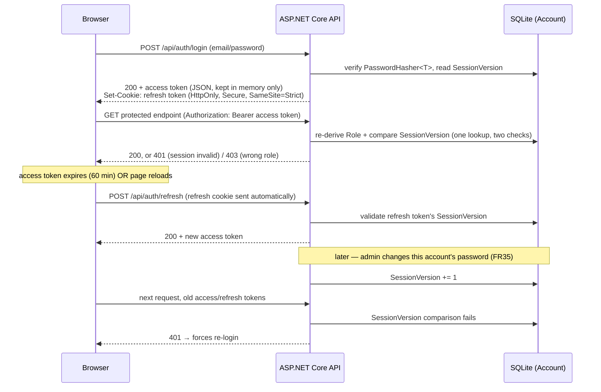
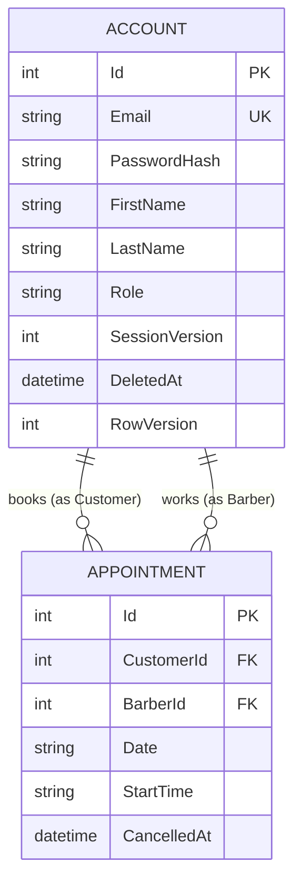

# Solution Design — Barbershop Appointment Scheduler

## How to read this document

`ARCHITECTURE-SPINE.md`, in the same folder, is the enforceable build contract: eighteen AD blocks stating *what must be true*, stripped down so they stay checkable against actual code. That terseness is deliberate — a spine that argues with itself in every clause stops being useful as a rule you can grep for. But it means the spine reads, on its own, like a list of assertions with no visible thinking behind them.

This document is the other half. It walks back through the design discussions between the architect (Winston) and Jack that produced those eighteen decisions, and restores the reasoning: what the alternatives were, why they were rejected, what got traded away on purpose, and which calls were closed quickly versus revised two or three times before landing. Nothing here should contradict the spine — where they'd ever disagree, the spine wins, since it's the version code gets checked against. Consider this the "minutes of the meeting" to the spine's "signed contract."

One constraint worth flagging up front, because it shapes several decisions below: this app has no production deployment target (NFR7) — it runs locally, full stop. That's not a gap the architecture works around quietly; it's why CI, rather than a live deployment, is the thing this architecture treats as the actual release-readiness signal (Section 6) — proving the codebase stays deployable even though nothing is ever actually deployed anywhere.

Before this document was written, the spine itself went through a reviewer gate: three reconciliation passes (one each against the PRD, the addendum, and the UX DESIGN.md), a rubric walk, a stack/version-verification pass, and an adversarial-incompatibility check. That gate surfaced nine real gaps — a missing double-booking index, an unspecified soft-delete behavior, an unstated status-code convention, a couple of stale package versions, and so on — all of which were resolved and folded into the spine before this companion was written. Several sections below call out *which* decisions were reviewer-gate catches versus decisions made directly with Jack, since the two came from different kinds of scrutiny and both are worth being able to tell apart.

---

## 1. Overview & Purpose

**What's being built:** a local, three-role (Customer / Barber / Admin) appointment-scheduling web app for a barbershop — book, cancel, and view appointments; barbers and admins manage schedules; admins manage accounts and roles. Backend is ASP.NET Core on .NET, frontend is React, data lives in SQLite. All of this was locked by the PRD before architecture started; nothing in this document revisits the choice of stack family, only how it's used.

**What architecture had to resolve:** the PRD and its addendum left several things explicitly open — most importantly the session/auth mechanism, how a permission or password change should propagate to an already-logged-in session, and the exact shape of the data model. The addendum flagged these as "leaning JWT" or "leaning a session-version counter" but explicitly deferred the final call to this stage. That's the bulk of what this architecture stage actually had to work through, and it's why the Auth & Session section below is the longest in this document — it took the most design iteration to get right.

**Operating constraints that shaped every decision below:**
- **NFR7** — runs locally only; no production hosting or public deploy target exists. This isn't a limitation the architecture works around quietly; it's load-bearing for how CI is framed (Section 6) and why there's no discussion of blue/green deploys, environments, or secrets managers anywhere in this document.
- **NFR1** — all dates/times are interpreted and compared in a fixed EST timezone, server-authoritative.
- **NFR2** — booking/cancel/account-edit races resolve transactionally: first commit wins, the second gets a conflict error, never silent corruption. This single guarantee shows up twice in the data model (once for appointments, once for accounts) rather than being invented separately each time.
- **NFR6** — code organized by responsibility, one controller/service per role area or domain concept, no god-classes — and notably, this is **assessed by manual review, not a test**. That's worth flagging honestly: nothing in CI will catch a god-class forming over time. The mitigation is structural (Section 2), not automated.

**Sources:** `prd.md` and `addendum.md` (PRD folder dated 2026-07-21) and `DESIGN.md` (UX folder dated 2026-07-23). No parent architecture spine exists to inherit from — this is the first and only one for the project.

---

## 2. Design Paradigm & Why

**The call:** Layered architecture — `Controllers → Services → Repositories`, one-way dependency, never reversed or skip-level.

This was one of the earliest calls in the conversation, and it was an explicit choice between two named alternatives, not an unexamined default. Winston presented layered architecture against **vertical slice** (one folder per use case — `RegisterUser`, `BookAppointment`, `CancelAppointment` — each owning its own thin request/handler/response, little shared service layer): vertical slice's main selling point is avoiding cross-feature coordination overhead on a large team with many concurrently-evolving features, which barely applies to a solo build with roughly fifteen endpoints total. Layered was also the more conventional, "boring" choice for a solo developer to build and maintain without a team to lean on — familiar enough that there's little risk of getting the pattern itself wrong while still building out the rest of the app. Jack agreed with that lean directly.

Once layered was chosen, the specific granularity — one trio per domain concept rather than some other split — followed quickly from NFR6's wording, not arbitrarily. NFR6 doesn't just say "avoid god-classes" in the abstract — it specifically says *one controller/service per role area or domain concept*. That phrase already rules out the two failure modes that make layering pointless in a small app:

- **A single catch-all class per layer** (one `Service` class doing auth, booking, and admin logic) directly violates NFR6's "no god-classes," and is exactly the failure mode a three-role app is prone to when everything's small enough to feel like it "should" fit in one file.
- **A trio per entity** rather than per domain concept would over-fragment a two-entity app (`Account`, `Appointment`) into more ceremony than the actual complexity warrants — the three domain concepts the PRD already organizes the product around (Auth, Booking, Account/Admin) are a better seam than the two database tables underneath them, since e.g. account *management* (admin editing/deleting/promoting accounts) is a meaningfully different concern from account *authentication*, even though both eventually touch the same `Account` table.

So the trio-per-domain-concept granularity — one `Controller`/`Service`/`Repository` set each for Auth, Booking, and Account/Admin — sits deliberately between those two failure modes, sized to match how the PRD already partitions responsibility by role, not by table.

The one-way dependency rule (Controllers depend on Services depend on Repositories, never the reverse, never skipped) exists to close off the single shortcut that's genuinely tempting in an app this size: a controller reaching directly into EF Core because "it's just one query." Once that shortcut is taken once, the layering stops providing any value at all, so the rule is stated as absolute rather than "generally."

Because NFR6 compliance is manually reviewed rather than tested, the source tree itself (see the spine's Structural Seed section) is the actual enforcement mechanism — the folder structure (`Controllers/`, `Services/`, `Repositories/`, one trio per concept) makes a violation visually obvious in a way a passing test suite wouldn't.

---

## 3. Auth & Session Architecture

This was the largest single discussion in the whole architecture conversation, and it went through more revisions than any other decision — worth walking through in the order it actually happened, because the reasoning at each revision only makes sense in light of what it was replacing.

### 3.1 Starting point: what the addendum left open

The addendum made a soft call — "leaning JWT (token-based) over server-side cookie sessions, given the React+.NET split" — but explicitly punted the final mechanism to architecture. It also flagged two specific open problems rather than solutions:

1. **FR35 — admin-driven password change should invalidate existing sessions.** The addendum's lean here was a per-account session-version counter stamped into issued tokens.
2. **Permission/role changes need to be "live.**" If an admin demotes a barber mid-session, that barber's already-issued token still claims the old role — the addendum named two possible fixes (no role claim in the token at all, forcing a DB check every request; or a short-lived auto-refreshed token) without picking one.

Both of these turned out to have different, and separately-motivated, answers — which is itself worth noting, because it would have been easy to solve them with one mechanism (e.g., "just invalidate the whole session on any account change") and that would have been the wrong call, as explained below.

### 3.2 Role liveness: solved by never trusting the claim, not by revoking the token

The role-liveness problem was resolved by deciding that **role is never trusted from a JWT claim at all** — every protected endpoint re-derives the account's current role from the database on every request. This sounds like it should be expensive, but it isn't: the same per-request lookup is *already required* to check the session-version counter (below), so verifying role liveness costs zero additional queries — it's a second field read off a row you were already fetching.

This also cleanly resolves the specific edge case that motivated the question in the first place: a barber gets demoted while they still have a browser tab open with an active session. With DB-derived role checks, the very next protected request that barber makes gets rejected at the role-check step — *before* the app even loads or considers whatever appointment/action the stale tab was trying to act on. There's no window where a demoted barber's stale token still "works" for anything, and no need to build any kind of active-session revocation to close that window.

### 3.3 Session invalidation: a narrower mechanism, deliberately not reused for role changes

The session-version counter (`SessionVersion`, an int column on `Account`) is a *different* mechanism serving a *different* purpose: it's stamped as a JWT claim at sign-in and compared against the DB's current value on every protected request; a mismatch forces a 401 and re-login. Only one thing increments it: an **admin-driven password change** (FR35). Permission/role changes never touch it.

That split is deliberate, not an oversight — role liveness is already fully handled by the DB re-check in 3.2, so bumping `SessionVersion` on every permission change would be redundant machinery solving a problem that's already solved a different way. Reserving `SessionVersion` for password changes keeps its semantics narrow and unambiguous: "this counter changing means the credential itself changed," which is exactly the FR35 requirement it exists to satisfy.

### 3.4 Token transport: three iterations, not one

This is where the conversation moved the most. Three distinct designs were considered in sequence, each one superseding the last:

**Iteration 1 — the addendum's starting lean:** JWT bearer token stored in `localStorage`. Simple, standard SPA pattern, but readable by any JavaScript running on the page — including injected JavaScript from an XSS vulnerability.

**Iteration 2 — single JWT in an HttpOnly cookie.** In response to Jack's explicit request for "max reasonable security," the design moved to a single JWT set via `Set-Cookie` at login, marked `HttpOnly` + `Secure` + `SameSite=Strict` — never readable by frontend JS at all. This directly trades away the convenience of reading claims (name, role) out of the token client-side, in exchange for closing the XSS-exposure gap that `localStorage` leaves open. The immediate consequence of that trade-off was that the frontend now had *no way* to know who was logged in for rendering purposes (nav bar, account page) — which is why `GET /api/auth/me` was added as its own endpoint at this point, purely to give the frontend a legitimate, server-validated channel to ask "who am I" since it can no longer just decode its own cookie.

**Iteration 3 — split access/refresh tokens, superseding iteration 2.** The single-cookie design was revised again into the mechanism that actually shipped: a short-lived **access token** (JWT, 60-minute expiry) held only in memory — a JS variable / React state, never `localStorage`, never a cookie — sent as an `Authorization: Bearer` header; and a long-lived **refresh token** (JWT, 15-day expiry, carrying the same `SessionVersion` claim) in the `HttpOnly`+`Secure`+`SameSite=Strict` cookie. `POST /api/auth/refresh` reads the refresh cookie, validates `SessionVersion`, and mints a fresh access token. It's called in two situations: when the access token expires mid-session, and on every fresh page load — the second trigger matters because the in-memory access token evaporates on every reload by construction, so hitting `/refresh` on load is what makes "still logged in" persist across browser restarts up to the 15-day bound, rather than forcing a fresh login on every page refresh.

Why iterate again past a design that was already HttpOnly-cookie-safe? Because iteration 2 protected the token from *reading* but the single artifact still lived for the full session length with no separately-scoped, shorter-lived credential doing the actual per-request work. Splitting the two means the artifact attached to every single API call (the access token) has a short, bounded useful life (60 minutes) even if it somehow leaked through some channel other than XSS — a compromised log line, a proxy, a browser extension with network access — while the artifact that's actually long-lived (the refresh token) never leaves the one channel (an HttpOnly cookie) that's structurally immune to JS-based exfiltration in the first place. Password changes still invalidate both, for free, through the same `SessionVersion` bump — no second invalidation mechanism was needed for the new design.

### 3.5 Refresh-token rotation: a named, accepted trade-off

The refresh token is **non-rotating** — it reuses the same `SessionVersion`-based JWT validation already built for everything else, with no additional server-side refresh-token table and no rotation/reuse-detection scheme. This was discussed explicitly as a trade-off, not settled by default: the accepted downside is that **a stolen refresh cookie remains valid for up to 15 days, or until the next password change, whichever comes first.** Building rotation (issuing a new refresh token on every use, detecting reuse of an old one as a compromise signal) would close that window, but at the cost of a new persistence concern the app doesn't otherwise need. The call was to accept the named 15-day exposure window now, in exchange for zero added infrastructure, and revisit it later if that window ever becomes the thing actually being defended against (see Deferred, Section 8).

### 3.6 Supporting mechanics

A handful of smaller decisions round out the auth surface, each closing a specific gap:

- **Rate limiting (login only):** built-in `Microsoft.AspNetCore.RateLimiting`, sliding window, 5 attempts per email+IP per 15-minute window — no third-party package needed since .NET ships this natively. Critically, a 429 (rate-limited) response returns the *exact same generic invalid-credentials message* as a normal failed login, so an attacker can't distinguish "you're rate-limited" from "wrong password" as separate signals to probe against.
- **First-admin bootstrap:** a single `IHostedService` runs after `Database.Migrate()`, checks whether any admin-role account exists, and seeds exactly one via `PasswordHasher<T>` if not. Credentials come only from environment variables (`AdminSeed__Email` / `AdminSeed__Password`) — shell-set locally, a GitHub Actions repository secret in CI. This deliberately supersedes the addendum's original lean toward `dotnet user-secrets`: user-secrets would mean two different credential-supply tools to keep in sync (a local-only .NET mechanism, versus whatever CI actually needs), for a project with exactly one seeding problem to solve. One path, everywhere, was the simplification. (The reviewer gate specifically flagged that this divergence from the addendum needed its rationale stated explicitly, rather than reading as an unexplained contradiction — this paragraph is that rationale.)
- **401 vs. 403, fixed by convention:** 401 means unauthenticated or session-invalid (missing/expired access token, `SessionVersion` mismatch); 403 means authenticated but wrong role. This was pinned down explicitly during the reviewer gate specifically so individual controllers wouldn't each invent their own inconsistent status-code judgment calls over time.
- **`Role` as a fixed enum:** `Customer` | `Barber` | `Admin`, PascalCase, one shared type referenced everywhere — seeder, auth checks, DB storage. This closes off a subtle but real bug class: a stringly-typed role field drifting into `"Admin"` in one place and `"admin"` in another, which would silently break every role comparison in the app.
- **CORS and credentialed requests:** because the refresh flow depends on a cookie, the API's CORS policy has to explicitly allow the Vite dev-server origin with `AllowCredentials()`, and every frontend fetch touching auth has to set `credentials: 'include'` — otherwise the refresh cookie silently never gets sent, which fails in a confusing way (requests just look "logged out" with no error). One detail worth stating precisely since it's easy to get backwards: `SameSite=Strict` is unaffected by frontend/backend running on different *ports* during local dev, because "site" for `SameSite` purposes means registrable domain, not port — and NFR7's local-only scope means the harder cross-domain `SameSite=None` case (which would be needed for a real cross-domain production deploy) never actually arises here.
- **Client-side routing mirrors server-side gating (AD-18):** React Router route guards call `GET /api/auth/me` to determine identity/role before allowing a route, and redirect otherwise. This is stated explicitly as *not* a security boundary on its own — hiding a nav link or blocking a client route is a UX nicety, never the actual enforcement, which is the same principle Section 3.2 already established server-side (never trust a client-visible signal as the real gate).

---

## 4. Data Model & Integrity Guarantees

The data model is deliberately minimal: two entities, `Account` and `Appointment`. Both use plain **int auto-increment primary keys**, not GUIDs — the explicit justification being that this is a single local SQLite instance with no distributed-write concern (no multi-node replication, no offline-sync-then-merge scenario), so GUIDs would add nothing but an unenforced convention flag: don't switch to GUIDs without revisiting this decision, because doing so implicitly claims a distributed-write scenario that doesn't exist.

**Appointment status is computed, never stored.** "Finished" (FR24) isn't a column — it's derived at read time by comparing an appointment's `Date`/`StartTime` against the current EST "now" (Section 4's timezone rule, below). The alternative — a stored `Status` field — would need a background job or scheduled task purely to flip appointments from "Upcoming" to "Finished" as the clock passes them, which is machinery that exists only to keep a cache in sync with a value that's trivially computable on demand. The only *real* state transition an appointment ever undergoes is cancellation, captured as a nullable `CancelledAt` — a soft-delete, with the row retained permanently for history (FR18/FR40 both require past appointments to remain visible/attributable).

That soft-delete framing mattered enough to need explicit clarification during the reviewer gate: FR18 and FR40 both use the phrase "cancels and deletes" to describe what happens to a barber's future appointments when that barber is demoted or removed. Read literally, "deletes" could mean a hard SQL `DELETE`. The architecture pins this down as meaning the *same* soft-cancel mechanism — setting `CancelledAt` — regardless of which trigger caused it: a customer cancelling directly, a barber-demotion cascade, or an account-deletion cascade. There is exactly one mechanism for "this appointment is off the books," used everywhere, never a second hard-delete pathway.

**Double-booking prevention is defense-in-depth, not a single check.** The primary guard is an application-level check-then-insert inside a database transaction. Underneath that sits a hard backstop: a SQLite partial unique index, `UNIQUE(BarberId, Date, StartTime) WHERE CancelledAt IS NULL` — so even if the application-level check has a bug, the database itself refuses to persist a genuine double-booking. The reviewer gate caught a real gap here against the PRD: FR9 also requires that the *same customer* can't hold two appointments at the same date/time across two different barbers, which the barber-side index alone doesn't prevent. A second, mirroring partial unique index was added to close it: `UNIQUE(CustomerId, Date, StartTime) WHERE CancelledAt IS NULL`. Both indexes exclude cancelled rows (`WHERE CancelledAt IS NULL`) precisely because cancellation is soft-delete — a cancelled appointment's old slot needs to be immediately re-bookable by anyone, including the same customer.

**Account soft-delete, with relaxed email uniqueness — a reviewer-gate-driven decision.** FR40 (deleting an account) initially risked the same "does deletion mean hard-delete?" ambiguity as the appointment case above, with a sharper consequence: hard-deleting an `Account` row would orphan the foreign keys on every historical `Appointment` that account was ever part of, breaking FR18/FR40's requirement that past appointments remain resolvable to a name. The resolution mirrors the appointment pattern exactly: a nullable `DeletedAt` column, same shape as `CancelledAt`, and the row is retained forever. The uniqueness constraint on `Email` is then scoped to non-deleted rows — `UNIQUE(Email) WHERE DeletedAt IS NULL` — which was a deliberate choice between two options: permanently burn the email address the moment an account is deleted (simpler, but means a real person can never re-register with their own email after deletion), or let a deleted account's email become registerable again immediately, matching how most real-world systems actually behave. The second option was chosen explicitly as "matching normal practice." A deleted account can never authenticate — every auth check treats `DeletedAt IS NOT NULL` identically to "this account does not exist," rather than as a special third state auth code needs to know about.

**Optimistic concurrency on Account edits (FR41).** Account gains an EF Core concurrency token (`RowVersion`/`[Timestamp]`). This is the same "first commit wins, second gets a conflict error" guarantee NFR2 already establishes for bookings (via the unique-index backstop above), applied here to a different race: an admin editing an account at the same moment the account holder edits their own profile, two admins editing the same account, or an edit racing a delete. The loser of the race gets a `409` via `ProblemDetails` rather than silently overwriting the winner's change. This is worth naming as a *pattern*, not two separate decisions — NFR2's "no silent corruption" guarantee gets satisfied by unique-index rejection for appointments and by concurrency-token rejection for accounts, but it's conceptually the same commitment enforced twice, for two different kinds of race (a slot collision vs. a same-row write collision).

**One shared read path for every appointment view (AD-17).** The customer's own appointment list, a barber's own schedule, and the admin's oversight view are three different UI surfaces reading the same underlying data — and a real risk in a small app is that each gets implemented as its own controller-level query, which then drift apart over time (one computes "Finished" slightly differently at a DST boundary, another names a field differently). The architecture closes this off by requiring all three to go through one shared `BookingService` method (or a shared read-model it returns), including the Finished computation itself. There is exactly one place in the codebase that decides what "Finished" means.

**Server-side re-validation of booking date rules (AD-14).** Whatever the calendar widget disables client-side (past dates, weekends, dates beyond the forward cap) is a UX convenience, never the actual enforcement — the server independently re-checks all of it on every booking submission: not in the past, a weekday, within the forward cap, and (for same-day bookings) not within 30 minutes of the current EST time. This is the same "hidden isn't enough" principle the auth section applies to nav links, applied here to form controls. Worth flagging honestly: this surfaced a genuine self-contradiction in the PRD — the user-journey narrative (UJ-1) says bookings have "no forward limit," while the numbered functional requirement (FR7) states a 30-day cap. The architecture follows the explicit numbered FR as authoritative and implements the 30-day cap, but the PRD text itself still disagrees with its own narrative and should be reconciled by Jack rather than silently left inconsistent.

**Fixed EST semantics (AD-12).** "EST," as used throughout the PRD, means **US Eastern Time** (`America/New_York`) — computed correctly with DST awareness, not a hardcoded UTC-5 offset that would silently drift an hour off twice a year. This required an explicit correction during the conversation: the PRD's use of "EST" was shorthand for "the timezone the shop operates in," not a deliberate, DST-ignoring literal choice of the specific UTC-5 offset. On the wire, dates and times are plain `yyyy-MM-dd` / `HH:mm` strings with no offset attached at all — the client never performs timezone math of any kind; the server is the sole authority on what "today," "in the past," and "within 30 minutes" mean, at every point they're evaluated.

---

## 5. Stack & Tooling Choices

| Layer | Choice | Note |
| --- | --- | --- |
| Runtime | .NET 10 (LTS, supported to 2028-11) | Locked by PRD; LTS window comfortably outlives the project. |
| Web framework | ASP.NET Core 10 Web API, `dotnet new webapi --use-controllers` | Controllers, not minimal APIs — matches the layered paradigm's Controller layer directly rather than fighting the template's default shape. |
| ORM / DB | EF Core 10.0.10 + `Microsoft.EntityFrameworkCore.Sqlite` 10.0.10 | |
| Auth | `Microsoft.AspNetCore.Authentication.JwtBearer` 10.0.9 | |
| Password hashing | ASP.NET Core Identity's `PasswordHasher<T>` (PBKDF2) | Reused rather than hand-rolled — no reason to write a hashing routine when a maintained, audited one ships with the framework. |
| Rate limiting | `Microsoft.AspNetCore.RateLimiting` (built-in) | Explicit call to *not* add a third-party rate-limiting package — the one endpoint that needs it (login) is fully covered by the built-in sliding-window limiter. |
| Frontend framework | React 19.2.8 | |
| Frontend language | Plain JavaScript, not TypeScript | Jack's explicit call, based on existing familiarity — a deliberate scope-management choice appropriate to a solo/learning project, not a technical constraint of the stack. |
| Data fetching | Plain `fetch` + React state | No React Query/TanStack Query — same reasoning as skipping MSW below: the fetch surface is small enough that a dependency for managing it doesn't pay for itself. |
| Build tool | Vite 8.1.5 (official React JS template) | Version corrected from 8.0.16 during the stack-verification pass — the original figure had gone stale between when the addendum was written and when the spine was finalized. |
| Routing | React Router, current major (v7+) | Deliberately left as "verify exact package name at scaffold time" rather than pinned now — the package has been renamed/repackaged across v6→v7→v8 recently enough that pinning today risked being wrong by the time scaffolding actually happens. |
| UI primitives | `@radix-ui/react-dialog` 1.1.21 (modal), `@radix-ui/react-select` 2.3.4 (dropdowns), `@radix-ui/react-popover` 1.1.16 + `react-day-picker` 10.0.1 (calendar) | Locked by UX: custom CSS/components everywhere except these three Radix primitives. Radix has no native calendar primitive of its own — Popover-plus-day-picker is Radix's *own* recommended pairing for building one, not an improvised combination. Flagged explicitly: recent Radix patch releases fixed real React-19 re-render bugs, so these pinned patch versions should be re-verified as still current at actual scaffold time, not assumed to still be right months later. |

The React-19/TypeScript/React-Query choices above are worth reading together as one coherent stance: for a solo developer building and maintaining this app alone, every one of these was a deliberate trade of "more standard/more scalable" for "matches what Jack already knows and matches the actual size of the problem." That's a legitimate engineering call for a small, single-developer app — it would be a different call for a team project or a larger one — and the architecture states it as such rather than presenting it as a universal best practice.

---

## 6. Testing & CI Strategy

**Backend tests never mock the database.** xUnit + `WebApplicationFactory` runs tests against a *real* SQLite instance, isolated from the developer's own dev database — this isn't a stylistic preference, it's NFR4's explicit requirement. Mocking the DB layer would mean the test suite could pass while a real EF Core query, a real transaction boundary, or a real partial-unique-index constraint silently fails — exactly the kind of bug the whole double-booking/concurrency design (Section 4) exists to prevent, so testing against a fake DB would undermine the very guarantees the architecture is built around.

**Frontend tests skip MSW, deliberately.** The stack is Vitest + jsdom + React Testing Library + `jest-dom` + `user-event`, with API calls stubbed directly via `vi.fn()`/`vi.spyOn(fetch)` — no Mock Service Worker. This is worth explaining rather than just stating, because MSW is a genuinely well-regarded tool and skipping it could look like an oversight: MSW's value is intercepting requests at the network layer so component tests don't need to know or care about `fetch`'s exact call signature, which pays for itself once an app has dozens of endpoints and evolving request/response contracts to keep test doubles honest against. This app has roughly a dozen fetch call sites total. At that scale, the infrastructure MSW brings (a service-worker-based interception layer, its own configuration and versioning) costs more in setup and maintenance than it saves versus just stubbing `fetch` directly at each call site. The decision was framed explicitly as "dependency/maintenance overhead not justified at this scale" — a considered trade-off given the actual surface area, not an unfamiliarity with the tool.

**Playwright is optional and mocks nothing**, kept available for end-to-end coverage if time allows, but not a required gate.

One version correction from the stack-verification pass: `@testing-library/jest-dom` moved from a vague "6.x" to a pinned 7.0.0 — worth noting because 7.0.0 requires Node ≥22 and a `@testing-library/dom` peer dependency, both of which the actual dev/CI environment need to satisfy, not just the package version itself.

**CI is one GitHub Actions workflow, on every push,** with the .NET suite (real SQLite) and the frontend Vitest suite running as parallel jobs. A red pipeline is treated as **not mergeable** — full stop. Since NFR7 rules out an actual deploy target, there's no live environment to point to as proof the app works; CI is what stands in for that, proving on every single push that the codebase *could* be deployed cleanly, even though nothing ever actually is.

**Dev and CI databases stay fully isolated from each other.** The dev SQLite file lives at `backend/BarbershopApi/App_Data/barbershop.db` and is gitignored — only the EF Core `Migrations/` folder (code, not data) is committed. The dev database starts **empty** on every fresh clone, populated only via `Database.Migrate()` at startup; there is deliberately no seeded sample data (see Section 8 — a conscious "not now" rather than an unconsidered gap). CI tests run against their own separate, temporary SQLite instance created fresh via `WebApplicationFactory` for each test run — they never touch, read, or write a developer's local `barbershop.db`. This isolation is what makes testing against a *real* SQLite instance (rather than a mock) safe to do at all: it only works cleanly if the test database can never leak into or corrupt anyone's actual working data.

---

## 7. Cross-Cutting Conventions

A handful of small, easy-to-get-wrong conventions were pinned down explicitly so individual controllers and components don't each invent their own local answer:

- **Naming:** PascalCase for C# types/methods/properties; camelCase for JSON payloads (the `System.Text.Json` default, not a custom serializer setting) and for JS/React code. Riding the framework's default serialization behavior rather than overriding it avoids an entire class of "why doesn't this field match" debugging.
- **Dates and times on the wire:** plain `yyyy-MM-dd` / `HH:mm` strings, no offset attached — a direct consequence of Section 4's fixed-EST decision. The client is never trusted to do timezone arithmetic; the server is the sole authority on "today," "past," and the booking cutoff, every time.
- **Error responses:** ASP.NET Core's built-in `ProblemDetails` (RFC 7807) — no extra library. `[ApiController]` validation errors get this automatically; custom errors (a booking conflict, a stale cancellation, an account-edit conflict) use the `Problem()` helper. One consistent error envelope shape across the entire API, rather than each controller inventing its own error object.
- **CORS and credentials:** the API's CORS policy explicitly allows the Vite dev-server origin with `AllowCredentials()`; every frontend fetch touching auth sets `credentials: 'include'` (see Section 3.6 for why this matters and what breaks silently if it's forgotten).
- **Concurrency — "first commit wins," one pattern applied twice:** the same NFR2 guarantee is enforced by a unique-index backstop for `Appointment` races and an EF Core `RowVersion` concurrency token for `Account` races (see Section 4 for both).

---

## 8. Deferred / Open Items

Items the architecture explicitly named as *not* decided now, along with why deferring each one is safe:

- **Refresh-token rotation and reuse-detection** (Section 3.5) — an accepted trade-off, not a gap. Revisit if the current 15-day stolen-cookie exposure window ever stops being an acceptable risk for the project's actual threat model.
- **Guest (unauthenticated) booking** — a PRD non-goal. It was raised in conversation as a possible future addition but never adopted; if it's added later, this architecture (particularly the auth-gated booking flow in Section 3) would need to be revisited, not assumed to already cover it.
- **Dev database seeding with sample data** — explicitly declined for now (Section 6); the dev DB starts empty by design, not by oversight.
- **Two UX open items that touch implementation but aren't architecture-level calls:** DESIGN.md doesn't yet define a validation/error color for form states (e.g., a password-mismatch message needs *some* color, and none is specified), and the tablet breakpoint is named but not given a pixel value. Both are flagged with an explicit owner — UX (Sally) — and a deadline relative to build order: resolve before the `ScheduleAppointment`, `Register`, or `Account` components are actually built, since those are the components that need the missing values.
- **A genuine PRD self-contradiction on the booking forward limit** (Section 4): UJ-1's narrative says "no forward limit," FR7 states a 30-day cap. The architecture follows FR7 as the authoritative, numbered requirement — but the PRD document itself still contains the contradiction on paper, and Jack should reconcile the two rather than leave them disagreeing.
- **Fast-moving package versions verified "current as of" the architecture conversation, not guaranteed current at build time:** specifically the Radix UI patch versions (recent patches fixed real React-19 re-render bugs, implying the ecosystem is still actively catching up) and the exact React Router package name (mid-transition across a v6→v7→v8 packaging change at the time of writing). Both are flagged for a fresh check at actual scaffold time rather than trusted from this document alone.
